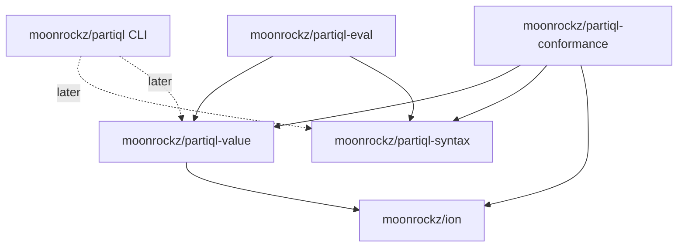

# Architecture

## Overview

This repository is one MoonBit workspace (`moon.work`) with several modules
under `modules/`. Each module is published to mooncakes.io on its own, with
one shared version (see [ADR 0002](adr/0002-lockstep-versioning.md)).

Module boundaries follow two questions:

- Who uses the code? A linter or a transpiler needs the parser but not the
  evaluator. A data tool needs the data model but not the parser.
- What does the code depend on? The data model depends on `moonrockz/ion`. The
  parser does not.

A package import path is the module name plus the package path. If a package
moves to a different module, every user breaks. Thus the module boundaries are
fixed from the start (see [ADR 0001](adr/0001-workspace-monorepo.md)).

## Module map

| Module | Packages | Depends on | Targets | Published |
|---|---|---|---|---|
| `moonrockz/partiql-value` | root (`Value`), `ion` (codec), `arbitrary` (generators) | `moonrockz/ion` | wasm, wasm-gc, js, native | yes |
| `moonrockz/partiql-syntax` | root (`parse`), `ast`, `lexer`, `parser` | `moonrockz/ion` | wasm, wasm-gc, js, native | yes |
| `moonrockz/partiql-eval` | root (`evaluate`), `plan`, `lower`, `ops`, `interp` | value, syntax, `moonrockz/ion` | wasm, wasm-gc, js, native | yes |
| `moonrockz/partiql` | root (executable), `cli` | `moonbitlang/x` (later: value, syntax, eval) | native, wasm | yes |
| `moonrockz/partiql-conformance` | root (test-only) | value, syntax, `moonrockz/ion`, `moonbitlang/x` | native, js | no |

The `partiql` module has the CLI as its root package, so
`moonx moonrockz/partiql` runs the tool. The `cli` package holds the command
logic; the root package only prints and exits.

## Dependency graph

## Package plan

- `partiql-value`
  - root: `Value`, the PartiQL data model: absent values, numbers, text,
    LOBs, `Date`/`Time`/`Timestamp`, intervals, `List`, `Bag`, `Tuple`, and
    `Map` (RFC 0104: `MapValue` with declared `MapType`s), `Graph` (RFC 0025:
    `GraphValue` with id-keyed nodes and edges), and `Ion` (boxed exact Ion,
    ADR 0005). Relations: structural `Eq`,
    `sql_equals` (the `=` operator), `eqg` (grouping) and `compare` (ORDER
    BY). One concern per file (`value.mbt`, `tuple.mbt`, `bag.mbt`,
    `datetime.mbt`, `interval.mbt`, `map.mbt`, `graph.mbt`, `numeric.mbt`,
    `text.mbt`,
    `identity.mbt`, `lower.mbt`, `equality.mbt`, `ordering.mbt`).
  - `ion`: the Ion codec in two modes: PartiQL-encoded (`from_ion`,
    `to_ion`, for partiql-tests data) and Ion-preserving (`from_ion_data`,
    `to_ion_data`, for Ion data; ADR 0005). Its default
    alias is `ion`, so it imports `moonrockz/ion/ion` as `@ion_core`.
    Consumers import it as `@partiql_ion`.
  - `arbitrary`: quickcheck generators (`gen_value`, `ArbValue`, ...) and
    the property laws of the data model. Published so that later milestones
    can reuse the generators.
- `partiql-syntax`
  - root: `parse(String) -> Statement raise ParseError`, `parse_script`,
    `parse_script_recovering(String) -> Recovered`, `print`, `print_script`
    and `format(String, width?) -> String raise ParseError`
    (re-exports `Statement`, `Script`, `Comment`, `ParseError`, `Span` and
    `Recovered` from `ast`).
  - `ast`: the syntax tree (Kotlin v1 style, one node per form, every node
    with a `Span` of UTF-16 offsets), `Span` and `ParseError` (`Syntax` with
    message, span, expected tokens and the found token; `Unsupported`),
    `Script` and `Comment`, `Recovered` (a partial script and its errors),
    the `Error` nodes of recovered trees (`ExprKind::Error`,
    `Statement::Error`), and `strip_spans` (structural equality).
  - `lexer`: tokens; keywords are words that the parser classifies;
    punctuation is one character per token and the parser composes `<<`,
    `<=`, `||` and similar operators from touching tokens; Ion literals are
    scanned Ion-aware and checked with the Ion text reader. `lex_recovering`
    records every lexical error and marks broken literals as `Invalid`
    tokens.
  - `parser`: recursive descent with a precedence ladder for expressions
    (OR, AND, NOT, IS TRUE/FALSE/UNKNOWN, predicates, `||`, `+ -`,
    `* / %`, signs, path steps), special forms by name, a reserved-word table
    (the Kotlin grammar's, without the datetime field words), and a nesting
    limit of 100 levels: deeper input is a `Syntax` error ("nesting is too
    deep"). The limit protects the call stack. Without it, debug builds
    overflow at these depths (measured 2026-10-01): nested queries
    (`(SELECT VALUE …)`) near 100 on wasm and near 200 on wasm-gc and js;
    nested parentheses near 150 on wasm, 300 on js and 500 on wasm-gc;
    native passed 500 of both. `parse_script_recovering` recovers from
    errors (`recover.mbt`): recovery points at statements, clauses and list
    items catch an error, record it, skip to a synchronizing token and
    return an `Error` node; trial parses and graph patterns run strict.
    Graph
    MATCH (GPML) is in `graph.mbt`.
  - `diagnostic`: `render(ParseError, source, name~, color?)` (rustc-style
    diagnostics) and `position` (1-based line, column in code points).
  - `sexp`: `to_sexp` and `expr_to_sexp`, the public S-expression format,
    laid out with `moonrockz/pretty`; deep chains are built with loops.
  - `printer`: syntax tree to text. It builds a document (Wadler-style
    algebra with groups and nests) and renders it flat for the canonical
    form, or through `moonrockz/pretty` at a width for the pretty layout;
    comments from the source are written at the nearest node boundary.
    Depends on `ast` and `moonrockz/pretty`.
- `partiql-eval`
  - root: `evaluate(Statement, env~, mode?) -> Value raise EvalError`,
    `evaluate_text(String, env~, mode?)`, `Bindings` (the global
    variables: `empty`, `of_tuple`, `of_ion`), and the re-exports `Mode`
    (`Permissive` or `Strict`) and `EvalError`.
  - `plan`: the logical plan (`Expr`, `Step`), `Mode` and `EvalError`
    (`TypeError`, `DataError`, `Unsupported`, `Syntax`). M4a has scalar
    expressions only; M4b adds relational operators (ADR 0006).
  - `lower`: syntax tree to plan. It desugars the surface forms, converts
    literals (numbers, datetimes, intervals, Ion) to values, and raises
    `Unsupported` with a span for a form that is not evaluated yet, or for
    a type parameter that `IS` does not check. Chains of binary operators,
    AND and OR are lowered in a loop; any other nesting deeper than 200
    levels (an Ion literal included) is a `DataError`, so the evaluator
    does not overflow the stack. One known exception is outside this module:
    the Ion text reader that scans Ion literals recurses per nesting level,
    so a literal nested about 10,000 levels deep overflows the stack before
    evaluation starts (moonrockz/ion#65, bead `partiql-5se.9`).
  - `ops`: the semantics of each operator as pure functions on values:
    numeric and decimal arithmetic, comparison, three-valued logic, LIKE,
    datetime and interval arithmetic, type tests and path steps. `=`
    compares the elements of collections with its own datetime rule, and
    IN uses `=`.
  - `interp`: walks the plan with a `Mode` and the bindings, and applies
    `ops`. Operator chains run in a loop.
- `partiql`
  - root: the executable.
  - `cli`: `run(args, io?) -> Outcome`, with the commands `parse`, `check`,
    `format`, `version` and `help`, and the global `--color`. Errors print as
    rendered diagnostics. File and stdin access comes in through the `Io`
    record, which `main.mbt` provides (`moonbitlang/x/fs` and
    `moonbitlang/async` stdin). See the CLI section of `AGENTS.md`.

## Rules

- Never move a package between modules.
- Library modules build and pass their tests on wasm, wasm-gc, js and native.
- Library code may use the base class library (`moonbitlang/core`,
  `moonbitlang/x`, `moonbitlang/async`) and `moonrockz/ion`. A
  target-restricted dependency needs `supported_targets` and a reason.
- The publish order (`mise-tasks/release/publish`) is `partiql-value`,
  `partiql-syntax`, `partiql-eval`, `partiql`.
