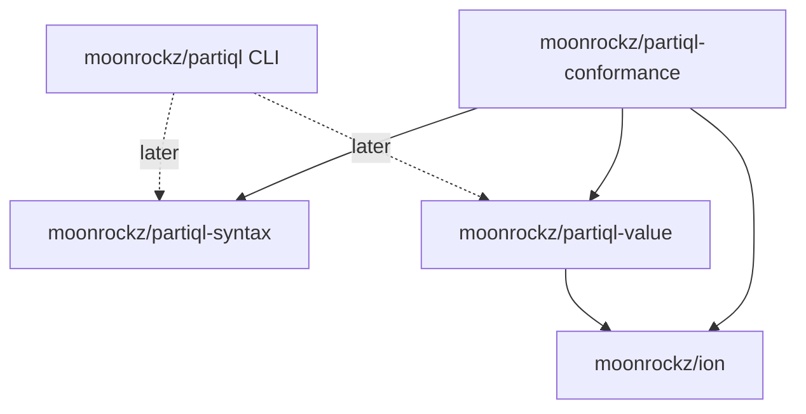

# Architecture

## Overview

This repository is one MoonBit workspace (`moon.work`) with several modules
under `modules/`. Each module is published to mooncakes.io on its own, with
one shared version (see [ADR 0002](adr/0002-lockstep-versioning.md)).

Module boundaries follow two questions:

- Who uses the code? A linter or a transpiler needs the parser but not the
  evaluator. A data tool needs the data model but not the parser.
- What does the code depend on? The data model depends on `moonrockz/ion`. The
  parser does not.

A package import path is the module name plus the package path. If a package
moves to a different module, every user breaks. Thus the module boundaries are
fixed from the start (see [ADR 0001](adr/0001-workspace-monorepo.md)).

## Module map

| Module | Packages | Depends on | Targets | Published |
|---|---|---|---|---|
| `moonrockz/partiql-value` | root (`Value`), `ion` (codec) | `moonrockz/ion` | wasm, wasm-gc, js, native | yes |
| `moonrockz/partiql-syntax` | root (`parse`) | none | wasm, wasm-gc, js, native | yes |
| `moonrockz/partiql-eval` | reserved: plan, catalog, functions, evaluator | value, syntax | all four | later |
| `moonrockz/partiql` | root (executable), `cli` | `moonbitlang/x` (later: value, syntax, eval) | native, wasm | yes |
| `moonrockz/partiql-conformance` | root (test-only) | value, syntax, `moonrockz/ion`, `moonbitlang/x` | native, js | no |

The `partiql` module has the CLI as its root package, so
`moonx moonrockz/partiql` runs the tool. The `cli` package holds the command
logic; the root package only prints and exits.

## Dependency graph

## Package plan

- `partiql-value`
  - root: `Value`, the PartiQL data model. M1 adds scalars, lists, bags and
    tuples, equality and ordering.
  - `ion`: the PartiQL-encoded Ion codec (`from_ion`, `to_ion`). Its default
    alias is `ion`, so it imports `moonrockz/ion/ion` as `@ion_core`.
    Consumers import it as `@partiql_ion`.
- `partiql-syntax`
  - root: `parse`. M2 adds the lexer, AST and parser packages, and M3 the
    printer. The M2 spec sets their names.
- `partiql`
  - root: the executable.
  - `cli`: `run(args) -> Outcome`. See the CLI section of `AGENTS.md`.

## Rules

- Never move a package between modules.
- Library modules build and pass their tests on wasm, wasm-gc, js and native.
- Library code may use the base class library (`moonbitlang/core`,
  `moonbitlang/x`, `moonbitlang/async`) and `moonrockz/ion`. A
  target-restricted dependency needs `supported_targets` and a reason.
- When `partiql-eval` is created, insert it before `partiql` in the publish
  order (`mise-tasks/release/publish`).
